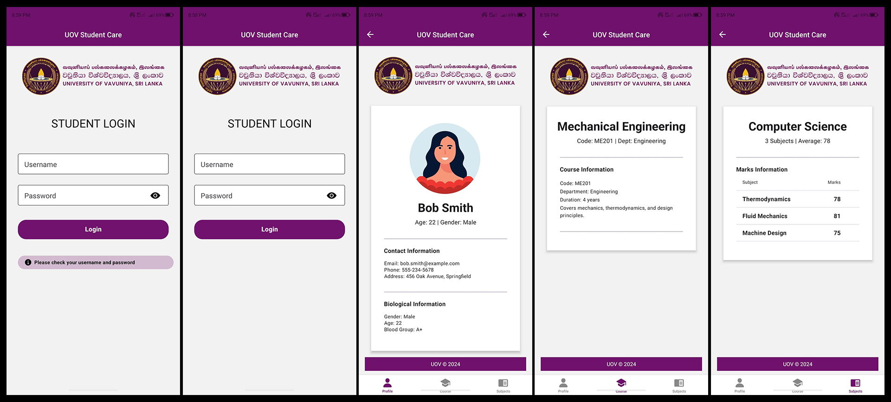
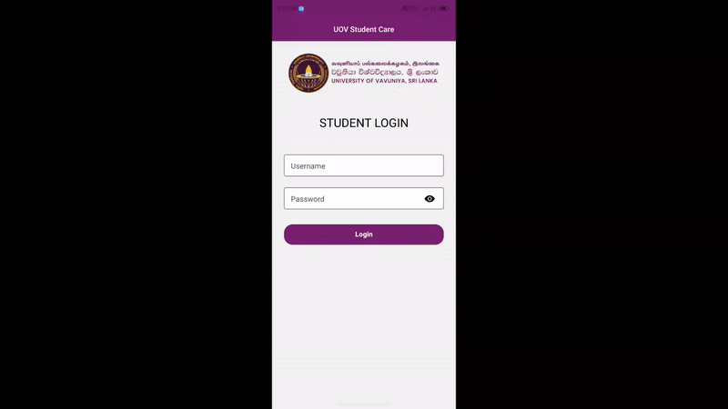

# UOV Student Care App  

## Assignment03-2020ICT58  

Learned in this assignment,  
- Navigate between screens using Stack Navigation and Bottom Bar Navigation.
- Passing props between screens when navigating.
- Implement the login functionality.

### Output  

## Demo  

